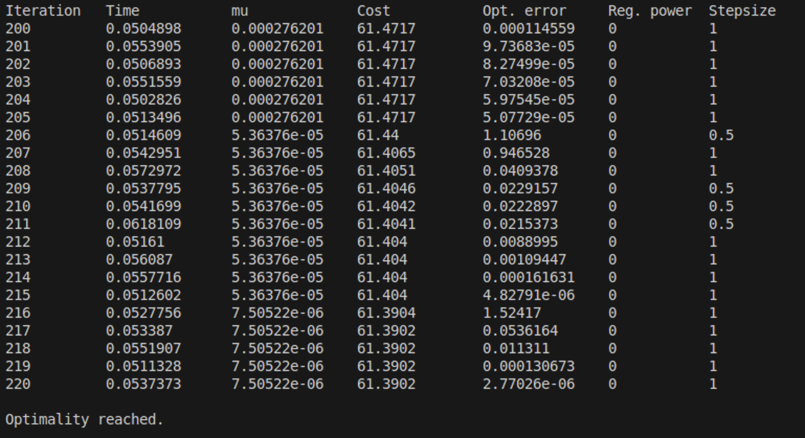
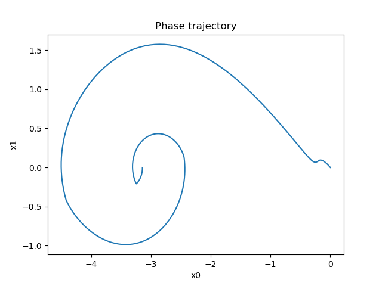
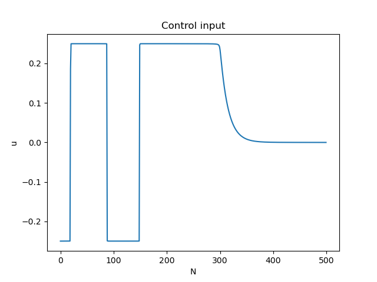
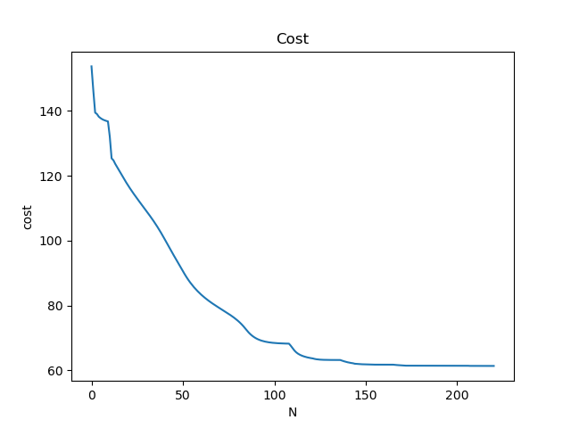

# Feasible_IPDDP
Implementation of Interior Point Differential Dynamic Programming using SymEngine.

The original MATLAB version is available at [ipddp](https://github.com/xapavlov/ipddp).

## Dependencies
- SymEngine: Fast symbolic manipulation library to achieve automatic differentiation.
- OpenMP: Parallelization is implemented to accelerate computation. (Optional) If not enabled, please comment out the relevant interfaces.

## Build and Run
```bash
mkdir build && cd build
cmake ..
make -j4
./examples/ocp_inverted_pendulum 
```

## Results






